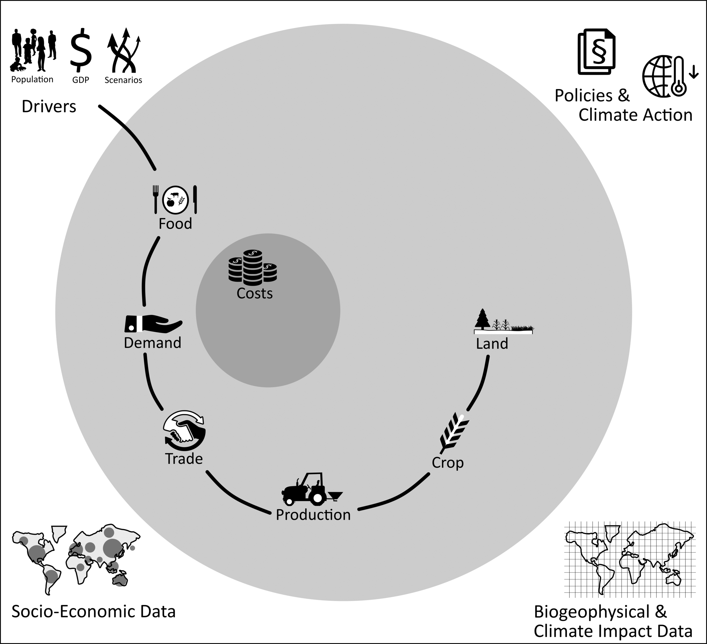

# 0 Preface: Structure of the MAgPIE Model

MAgPIE (Model for Agricultural Production and its Impacts on the Environment) is a modular open source framework for modeling global
land-systems. Before looking into the code structure, we want you to understand the basic dependecies of what we call 'modules'.
The full interdependencies and more detailed information can be found in our model documentation: https://rse.pik-potsdam.de/doc/magpie/

Here we want to just shortly draw your attention on the 'main line' of module interdependencies.

```{r, echo=FALSE, out.width = '100%',fig.align='center'}

```

- The future projections of population and GDP for given scenario assumptions represent the main drivers of the model.
- Food consumption patterns are derived based on the drivers and lead to a demand in primary products.
- Via trade demand patterns are translated into production patterns. 
- Production with the help of biophysical yield data is translated into cropping patterns interacting with land use decisions. 
- Note that this are not one way dependencies. E.g. constraints in land availability can have implications on food consumption patterns due to rising food prices for different commodities. 
- Associated costs are feeding into the goal function of the cost module at the core of the model.
- Around this 'main line' of agricultural production modules are build
    - assessing impacts and policy interactions (upper part)  
    - adding more detail to the production chain (lower part).

# 1 Introduction

The inner core of the MAgPIE model is written in GAMS. For the execution of the code, all parts of the code have to be put into a single file, the `full.gms`. All code chunks are stored within the `modules` folder. Every module, representing a component of the model, has several realizations, which are found in the `modules` folder. 
For the final model execution, exactly one realization of each module is chosen and included.  The  configuration settings that are set in `default.cfg` (or inside the run scripts) determine the realization entering the `full.gms`. 

### Learning objectives

The goal of this exercise is to understand the basic structure of the GAMS code. After completion of this exercise, you will be able to:

1. Navigate though the GAMS code.
2. Understand the basic structure of modules and realizations.
3. Understand the basic rules of variable or parameter naming conventions and their meanings.

# 2.1 Structure of a module

When you open the `modules` folder you will see a long list of all module and the `include.gms` (ensuring inclusion of all modules into the `full.gms`). 
Looking inside a module folder, every module is built following the same structure:

```{r, echo=FALSE, fig.cap="structure of any module", out.width = '30%',fig.align='center'}
knitr::include_graphics("figures/module_struc.png")
```

The module structure contains

* input folder with overarching input files for all realizations 
* realization folders containing the source code of each realization 
* [module_name].gms file with module description and listing of all realizations 
* several [realization_name].gms files with realization description and linking to the specific source code

New realizations can be added by keeping that structure (more in `7_advanced_changeCode.Rmd`). In that sense MAgPIE is easily extentable.

# 2.2 Structure within each realization

Within a realization the source code is distributed over several gms-files. This is nessessary to ensure the correct order of calculations (before, within and after the optimization). Moreover, the correct interfaces for model inputs and outputs are defined by this structure. In the following table, you see the purpose of each gms-file. Note that not every gms-files is needed in every realization. 


| gms.file   | function                |
|:------------------|:------------------------------------------------------------------|
| declarations.gms  | Declares all variables, equations, parameters that are central to this realization. |
| equations.gms     | Contains functional relationships that have to be fullfilled within the optimization. |
| input.gms         | Loads input from `any_module/input` or `any_module/a_realization/input` |
| sets.gms          | Lists sets that are used (mainly) within this specific realization or are needed for interfaces defined within this realilzation |
| preloop.gms       | Includes calculations to be executed before the model run. |
| presolve.gms      | Includes calculations to be executed before each time step.|
| postsolve.gms     | Includes calculations to be executed after each time step and defines output.|
| nl_fix.gms        | Fixes non-linear behaviour to linear behavior.|
| nl_release.gms    | Releases restrictions to linear behavior again. |
| not_used.txt      | Lists interfaces (declared in other modules) that are not used within this realization, but in other realizations of the same module | 


# 2.3 Coding etiquette variable and parameter naming

The MAgPIE model structure is build upon the idea that every module itself is encapsulated just interacting on a **clearly defined interface** with other modules. This reflects the idea that every module represents a separate part of the model, that could be represented in a simple or more sophisticated manner, without relying on other modules. In this sense realizations are replaceable within a module, since all realizations of a module have to deliver/interact with the same interface variables. This is ensured by defined rules for variable and parameter naming.

### Coding Etiquette

The following prefixes are used within the model code:

    q_ eQuations
    v_ Variables
    s_ Scalars
    f_ File parameters - these parameters contain data read from input file
    i_ Input parameters - influence the optimzation, but are not influenced by it
    p_ Processing parameters - influence optimization and are being influenced by it
    o_ Output parameters - influenced by optimization, but without effect on the optimization
    x_ eXtremely important output parameters - output parameters, that are necessary for the model to run properly (required by external postprocessing). They must not be removed.
    c_ switches from the Config.gms - parameters, that are switches to choose different scenarios
    m_ Macros

The prefixes have to be extended in some cases by a second letter:

    ?m_ module-relevant object - This object is used by at least one module and the core code. (Changes related to this object have to be performed carefully).
    ?00_ (a 2-digit number) module-only object - This 2-digit number defines the module the object belongs to. This object is only used by the respective module. (It makes sure that different modules do not contain the same object).

Note that sets are treated slightly differently: Instead of adding a prefix sets have a 2-digit number suffix (defining the number of the module in which the set is exclusively used). If the set is used in more than one module, it does not have any suffix.

In other cases, the prefixes have to be extended by a second letter:

    ?c_ value for the Current timestep - necessary for constraints. Each *c_-object must have a time-dependent counterpart
    ?q_ parameter containing the values of an equation
    ?v_ parameter containing the values of a variable

Suffixes indicate the level of aggregation of an object:

    (no suffix) highest disaggregation available
    _(setname) aggregation over set
    _reg regional aggregation (exception)
    _glo global aggregation (exception)


